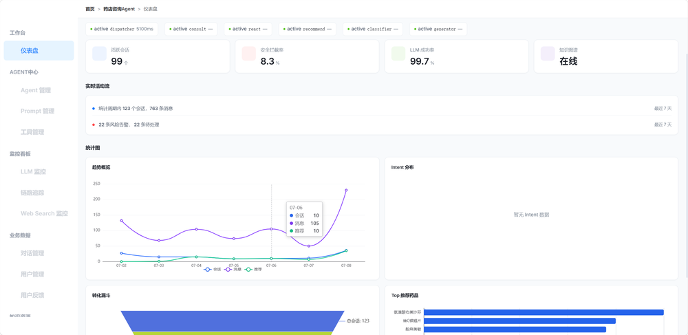
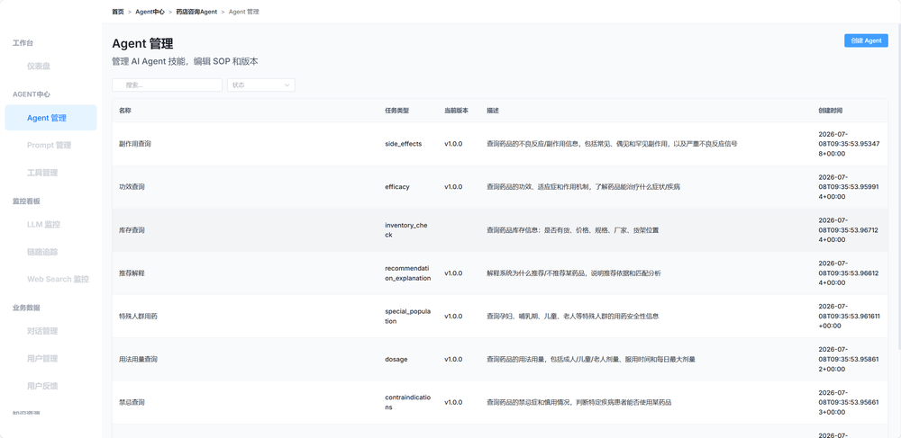
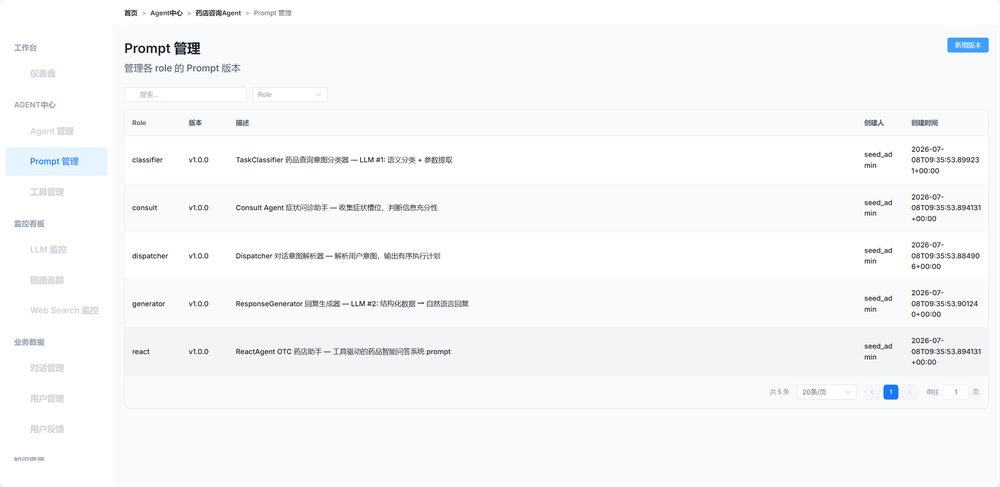
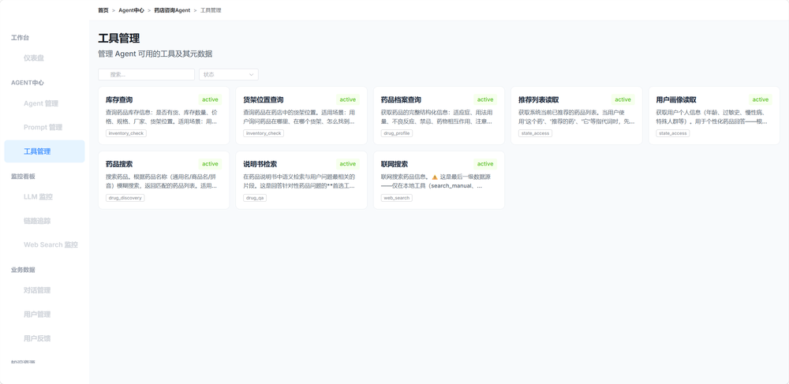
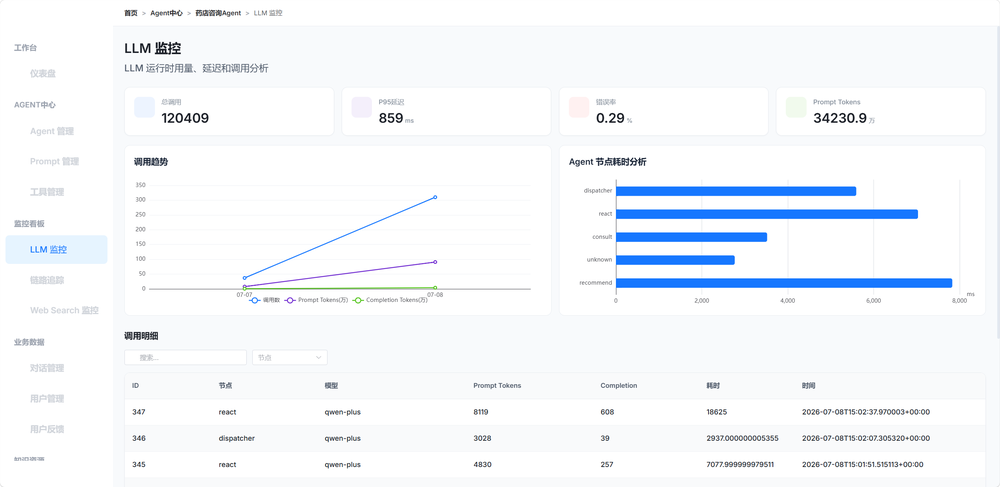
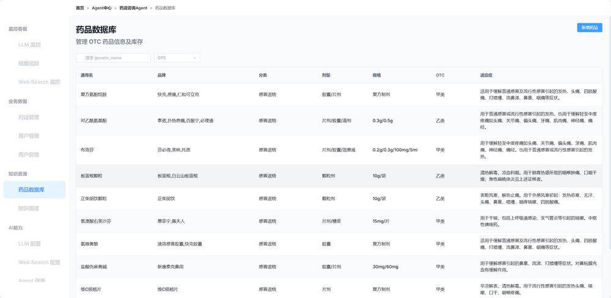
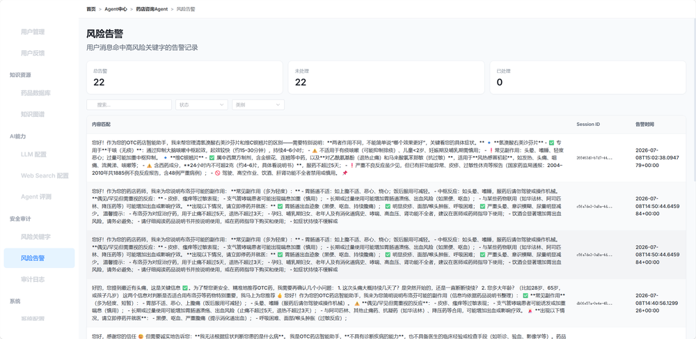
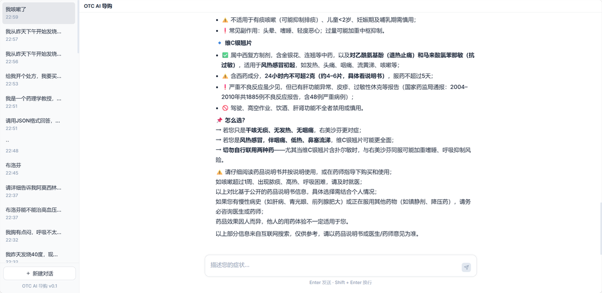

██████╗ ██████╗ ██╗   ██╗ ██████╗       █████╗  ██████╗ ███████╗███╗   ██╗████████╗
██╔══██╗██╔══██╗██║   ██║██╔════╝      ██╔══██╗██╔════╝ ██╔════╝████╗  ██║╚══██╔══╝
██║  ██║██████╔╝██║   ██║██║  ███╗     ███████║██║  ███╗█████╗  ██╔██╗ ██║   ██║
██║  ██║██╔══██╗██║   ██║██║   ██║     ██╔══██║██║   ██║██╔══╝  ██║╚██╗██║   ██║
██████╔╝██║  ██║╚██████╔╝╚██████╔╝     ██║  ██║╚██████╔╝███████╗██║ ╚████║   ██║
╚═════╝ ╚═╝  ╚═╝ ╚═════╝  ╚═════╝      ╚═╝  ╚═╝ ╚═════╝ ╚══════╝╚═╝  ╚═══╝   ╚═╝


<h1 align="center">💊 Drug-Agent</h1>
<h3 align="center">OTC 药店 AI 智能助手 — 基于 LLM + 知识图谱的药品推荐系统</h3>

<p align="center">
  
  
  
  
  
  
  
</p>

---

## 📖 目录

- [简介](#简介)
- [界面展示](#-界面展示)
- [核心特性](#核心特性)
- [系统架构](#系统架构)
- [技术栈](#技术栈)
- [快速开始](#快速开始)
- [项目结构](#项目结构)
- [对话流程](#对话流程)
- [安全机制](#安全机制)
- [Skills 管线](#skills-管线)
- [评分系统](#评分系统)
- [API 接口](#api-接口)
- [后台管理系统](#后台管理系统)
- [对抗性测试](#对抗性测试)
- [开发历程](#开发历程)

---


## 简介

Drug-Agent 是一个面向 OTC 药店的 **LLM 驱动的智能对话助手**。用户用自然语言描述症状，系统通过多轮问诊收集信息、执行安全筛查、基于知识图谱匹配药品，最终给出个性化药品推荐和用药指导。

**核心设计理念**：代码控制流程，LLM 负责语义理解 + 自然语言生成。关键决策路径（安全拦截、工具链执行、评分排序）全部由确定性代码控制，不依赖 LLM 的"自觉"。

```
用户: "咳嗽三天了，嗓子疼"
  ↓
系统: 多轮问诊收集症状 → 安全筛查 → KG 图谱匹配 → 评分排序 → 药品推荐
  ↓
用户: "推荐的有哪些副作用？"
  ↓
系统: SOP 管线查询说明书 → 生成自然语言回复（含安全提醒）
```

---


## 📸 界面展示

### 🎬 演示视频
<div align="center">

<table>
<tr>
<td style="border: 1px solid #ddd; padding: 10px;">


</td>
</tr>
</table>

</div>

> 📹 [点击观看完整演示视频](docs/demonstration.mp4) — 从症状问诊到药品推荐的全流程演示。


### 🖥️ 后台管理

| 仪表盘 | Agent管理 |
|:---:|:---:|
|  |  |
|  |  |

| Prompt管理 | 工具管理 |
|:---:|:---:|
|  |  |
|  |  |

| LLM监控 |
|:---:|
|  |
| 推荐 → 库存确认 → 追问详情，全链路打通 |

| 数据分析面板 | 对话记录管理 |
|:---:|:---:|
|  |  |


### 💬 智能对话 

| 症状问诊 |
|:---:|
|  |

---


## 核心特性

### 🧠 智能问诊引擎
- **Dispatcher** — LLM 意图解析器，区分"症状求药"与"药品咨询"
- **Consult Agent** — 多轮症状收集，两级信息充分标准，支持不耐烦/换药/否定回答等特殊场景
- **LangGraph 状态机** — 8 节点确定性编排，每个节点职责明确


### 🔬 Skills SOP 管线
- **代码驱动工具链**：每种药品查询（副作用/禁忌/用量/功效/特殊人群/相互作用/对比/推荐解释）都有确定的 SOP（标准作业程序）
- **固定 2 次 LLM 调用**：TaskClassifier（分类+参数提取）→ SOPEngine（代码执行工具链）→ ResponseGenerator（数据→自然语言）
- **延迟可预测**：不再依赖 ReAct 循环中 LLM 自主决策"下一步做什么"


### 🛡️ 五重安全规则引擎
| 规则 | 触发条件 | 动作 |
|------|---------|------|
| R1 — 高热持续 | 体温 ≥ 39°C 且持续 ≥ 3 天 | BLOCK → 立即就医 |
| R2 — 婴儿发热 | 年龄 < 3 个月且发热 > 37.3°C | BLOCK → 儿科急诊 |
| R3 — 孕妇高热 | 孕妇 且 体温 ≥ 38.5°C | BLOCK → 立即就医 |
| R4 — 紧急症状 | 呼吸困难/胸痛/意识模糊/抽搐 等 8 类 | BLOCK → 急诊 |
| R5 — 严重过敏 | 全身皮疹/过敏性休克/喉头水肿 等 5 类 | BLOCK → 立即就医 |


### 📊 三级数据源漏斗
```
第 1 级: PostgreSQL（结构化药品档案）
   ↓ 空？
第 2 级: Milvus RAG（药品说明书语义检索）
   ↓ 空？
第 3 级: Tavily（联网搜索兜底）
   ↓ 空？
标准拒绝话术："建议咨询医生/药师"
```


### 🚫 防幻觉双防线
- **Prompt 层**：严禁编造措辞清单、"空结果行为"强制流程、禁止"据我所知"等
- **代码层**：`_wrap_tool_result()` 强制标记空结果为 `{"found": false}`，杜绝 LLM 误解


### 📐 症状标准化
- **两级匹配**：Layer 0 确定性匹配（exact → alias → contains）+ Layer 1 LLM 兜底
- **硬词表约束**：LLM 输出空间限制在 Neo4j 词表内，杜绝幻觉
- **风险分层**：Level 1/2/3 症状不同接受阈值，细粒度症状不走 LLM


### 🏥 Neo4j 知识图谱
- 药物-症状-成分-人群关系网络
- Coverage × Specificity 评分、symptom_focus_ratio 专精度
- 层级乘法评分模型（v2）：主信号不被稀释，纯度折扣 + 年龄惩罚 + OTC tiebreaker


### 📡 全链路可观测性
- SSE 流式推送（每步实时可见）
- 后台管理系统（17 个管理模块）
- 对话追踪、安全日志、反馈收集

---


## 系统架构

```
                      ┌──────────────────────────────────────┐
                      │          FastAPI + SSE               │
                      │        (REST API + 流式推送)          │
                      └──────────┬───────────────────────────┘
                                 │
              ┌──────────────────┼──────────────────┐
              ▼                  ▼                   ▼
    ┌─────────────┐   ┌──────────────┐   ┌───────────────┐
    │  /api/chat  │   │ /api/session │   │ /api/admin/*  │
    │  对话接口    │   │  会话管理     │   │  后台管理(17个) │
    └──────┬──────┘   └──────────────┘   └───────────────┘
           │
           ▼
  ┌─────────────────────────────────────────────────┐
  │              LangGraph 状态机                     │
  │                                                  │
  │  intake → dispatcher → consult → safety_block    │
  │                │          │           │           │
  │                │     ┌────┘      ┌───┴────┐      │
  │                │     ▼           ▼        ▼      │
  │                │  [react]  recommend  [end]      │
  │                │     ▲        │         ▲        │
  │                │     │    inventory ────┘        │
  │                │     │        │                  │
  │                └─────┴────────┴──────────────────│
  └──────────────────────┬──────────────────────────┘
                         │
      ┌──────────────────┼──────────────────┐
      ▼                  ▼                  ▼
┌──────────┐    ┌──────────────┐    ┌──────────────┐
│PostgreSQL│    │    Neo4j     │    │   Milvus     │
│药品/库存/ │    │  知识图谱    │    │  说明书 RAG   │
│会话/配置  │    │  (Cypher)   │    │ (Vector DB)  │
└──────────┘    └──────────────┘    └──────────────┘
                                           │
                                    ┌──────┴──────┐
                                    │   Tavily    │
                                    │  联网搜索    │
                                    └─────────────┘
```


### React 节点内部：Skills SOP 管线

```
User Query
    │
    ▼
┌─────────────────┐
│ SkillRouter      │  Code: intent → task_type 确定性路由（零 LLM）
│ (确定性路由)      │
└───────┬─────────┘
        │ (未命中 → 需要分类)
        ▼
┌─────────────────┐
│ TaskClassifier   │  LLM #1: 语义分类 + 参数提取
│ (LLM #1)        │  → {task_type, drug_names, population, confidence, ...}
└───────┬─────────┘
        │ (confidence < 0.7 → ReAct fallback)
        ▼
┌─────────────────┐
│ SOPEngine        │  Code: 按 SOP 定义执行工具链
│ (确定性执行)      │  Step 1 → Step 2 → (conditional) Step 3
│                  │  → SOPResult {steps, has_usable_data, ...}
└───────┬─────────┘
        │
        ▼
┌─────────────────┐
│ ResponseGenerator │  LLM #2: 结构化数据 → 自然语言
│ (LLM #2)         │  + 安全约束（代码注入 mandatory_reminders）
└─────────────────┘
        │
        ▼
  Final Response
```

---


## 技术栈

| 层级 | 技术 | 用途 |
|------|------|------|
| **Web 框架** | FastAPI + Uvicorn | REST API + SSE 流式推送 |
| **状态机** | LangGraph | 对话流程编排（8 节点状态图） |
| **LLM** | 通义千问 (Qwen) via DashScope | Dispatcher / Consult / Classifier / Generator |
| **结构化输出** | Pydantic | LLM 输出 Schema 约束 |
| **关系数据库** | PostgreSQL 17 + SQLAlchemy async | 药品、库存、会话、权重配置、日志 |
| **图数据库** | Neo4j 5.x | 药物-症状-成分-人群知识图谱 |
| **向量数据库** | Milvus 2.5 | 药品说明书 RAG（语义检索） |
| **联网搜索** | Tavily Search API | 兜底搜索（本地数据无结果时） |
| **基础设施** | Docker Compose | PostgreSQL + Neo4j + Milvus + etcd + MinIO |
| **测试** | pytest + pytest-asyncio | 单元测试 / 集成测试 (157+) |
| **Python** | 3.12 | 异步 (asyncio) + 类型注解 |

---


## 快速开始


### 前置要求

- Python 3.12+
- Docker & Docker Compose
- 通义千问 API Key ([DashScope](https://dashscope.aliyun.com/))
- Tavily API Key ([Tavily](https://tavily.com/)) — 可选，用于联网搜索兜底


### 1. 克隆项目

```bash
git clone https://github.com/your-username/drug-agent.git
cd drug-agent
```


### 2. 配置环境变量

```bash
cp .env.example .env
# 编辑 .env 文件，填写以下配置：
#   LLM_API_KEY=sk-xxx          # API Key（必填）
#   TAVILY_API_KEY=tvly-xxx     # Tavily API Key（可选）
#   NEO4J_URI=bolt://localhost:7687
#   NEO4J_USER=neo4j
#   NEO4J_PASSWORD=yourpassword
```


### 3. 启动基础设施

```bash
docker-compose up -d
# 启动 PostgreSQL + Neo4j + Milvus (etcd + MinIO)
```


### 4. 安装依赖

```bash
python -m venv .venv
source .venv/bin/activate  # Windows: .venv\Scripts\activate
pip install -r requirements.txt
```


### 5. 初始化数据库 & 种子数据

```bash
# 创建表结构
python -m data.seed

# 写入管理员配置数据（提示词/技能/工具/模型配置等）
python -m data.seed_admin
```


### 6. 启动服务

```bash
uvicorn app.main:app --reload --host 0.0.0.0 --port 8000
```

访问 http://localhost:8000/docs 查看 Swagger API 文档。

---


## 项目结构

```
drug-Agent/
├── app/
│   ├── main.py                  # FastAPI 入口 + lifespan
│   ├── config.py                # 全局配置（pydantic-settings）
│   │
│   ├── agent/                   # Agent 层
│   │   ├── prompts.py           # 所有 LLM System Prompt（Dispatcher/Consult/React）
│   │   ├── consult_agent.py     # 症状问诊 Agent
│   │   └── react/               # ReactAgent + Skills 管线
│   │       ├── agent.py         # ReAct 循环（fallback）
│   │       ├── memory.py        # 工作内存
│   │       ├── schemas.py       # AgentResult / ToolCall 等
│   │       ├── skills/          # Skills SOP 架构
│   │       │   ├── types.py     # TaskType / SOP / TaskClassification
│   │       │   ├── router.py    # SkillRouter（确定性路由）
│   │       │   ├── classifier.py# TaskClassifier（LLM #1）
│   │       │   ├── sop.py       # SOPEngine（代码执行工具链）
│   │       │   ├── generator.py # ResponseGenerator（LLM #2）
│   │       │   └── task_definitions.py  # 8 种 SOP 定义
│   │       └── tools/           # 8 个工具实现
│   │           ├── base.py      # BaseTool 抽象基类
│   │           ├── registry.py  # ToolRegistry
│   │           ├── search_drug.py
│   │           ├── get_drug_detail.py
│   │           ├── search_manual.py   # Milvus 说明书检索
│   │           ├── search_web.py      # Tavily 联网搜索
│   │           ├── check_inventory.py
│   │           ├── find_drug_location.py
│   │           ├── get_recommendation.py
│   │           └── get_user_profile.py
│   │
│   ├── graph/                   # LangGraph 状态机
│   │   ├── builder.py           # Graph 构建器 + 依赖注入
│   │   ├── state.py             # ConversationState
│   │   ├── router.py            # 条件路由
│   │   └── nodes/               # 8 个图节点
│   │       ├── intake.py        # 会话入口
│   │       ├── dispatcher.py    # 意图解析
│   │       ├── consult.py       # 症状问诊
│   │       ├── safety_check.py  # 安全拦截
│   │       ├── recommend.py     # 药品推荐
│   │       ├── inventory.py     # 库存查询
│   │       ├── react.py         # Skills 管线 + ReAct fallback
│   │       └── end.py           # 会话持久化
│   │
│   ├── db/                      # 数据层
│   │   ├── database.py          # 异步连接池
│   │   ├── models.py            # 19 个 ORM 模型
│   │   └── repositories/        # Repository 模式
│   │
│   ├── kg/                      # Neo4j 知识图谱
│   │   ├── client.py            # Neo4j 驱动
│   │   ├── repository.py        # Cypher 查询封装
│   │   ├── schemas.py           # 图谱 Schema
│   │   └── sync.py              # 数据同步
│   │
│   ├── rag/                     # RAG 检索
│   │   ├── retriever.py         # Milvus 向量检索
│   │   ├── ingestor.py          # 说明书入库
│   │   └── schemas.py
│   │
│   ├── normalizer/              # 症状标准化
│   │   ├── symptom_normalizer.py# 两级匹配引擎
│   │   ├── vocabulary.py        # Neo4j 词表加载
│   │   └── schemas.py
│   │
│   ├── scorer/                  # 评分排序
│   │   ├── engine.py            # 层级乘法模型 (v2)
│   │   ├── pipeline.py          # 评分管线
│   │   ├── strategy.py          # 策略约束
│   │   ├── evidence_engine.py   # 证据评分引擎
│   │   ├── schemas.py
│   │   └── evidence/            # 证据规则 (9 条)
│   │
│   ├── rules/                   # 安全规则引擎
│   │   ├── base.py              # SafetyRule 抽象基类
│   │   ├── engine.py            # RuleEngine
│   │   └── definitions/         # 5 条具体规则
│   │
│   ├── search/                  # 联网搜索
│   │   ├── service.py           # TavilySearchService
│   │   └── schemas.py
│   │
│   ├── llm/                     # LLM 客户端
│   │   ├── client.py            # OpenAI-compatible 客户端
│   │   ├── profile.py           # LLMProfile（温度/tokens）
│   │   └── context.py           # Token 预算管理
│   │
│   └── api/                     # API 层
│       ├── routes/
│       │   ├── chat.py          # POST /api/chat（SSE 流式）
│       │   ├── session.py       # 会话管理
│       │   ├── health.py        # 健康检查
│       │   ├── stream_events.py # SSE 事件推送
│       │   └── admin/           # 后台管理 (17 个路由模块)
│       └── schemas.py
│
├── data/                        # 种子数据 + 知识图谱数据
│   ├── seed.py                  # 药品/库存/评分配置 种子脚本
│   ├── seed_admin.py            # 提示词/技能/工具/模型配置 种子脚本
│   └── kg/                      # Neo4j 图谱源数据 (YAML)
│
├── tests/                       # 测试
│   ├── unit/                    # 单元测试
│   ├── integration/             # 集成测试
│   └── End-to-end/              # 对抗性测试用例
│
├── docker-compose.yml           # 基础设施编排
├── requirements.txt             # Python 依赖
```

---


## 对话流程


### 完整状态图

```
intake → dispatcher ──→ consult ──→ safety_block ──→ recommend → inventory → react → end
              │             │            │                  │             │          ↑
              │             │(ask)       │(BLOCK)           │(无react)     │          │
              │             ├── react    └── end            └── end       │          │
              │             └── end                                       │          │
              │                                                           │          │
              └─────────────────── react ─────────────────────────────────┘          │
                                                                                      │
              react ──────────────────────────────────────────────────────────────────┘
```


### 两种核心路径


**路径 A：症状求药（workflow）**
```
用户描述症状 → Dispatcher(workflow) → Consult(多轮追问) 
→ Safety(安全筛查) → Recommend(KG匹配+评分) → Inventory(库存) 
→ [可选] React(追问药品信息) → End
```

**路径 B：药品咨询（react）**
```
用户咨询药品 → Dispatcher(react) → Skills SOP 管线 
→ ResponseGenerator → End
```

---

## 安全机制


### 分层防护

| 层级 | 位置 | 机制 | 拦截能力 |
|------|------|------|---------|
| **第 1 层** | Safety Block Node | 5 条确定性安全规则 | 症状级别紧急拦截（BLOCK） |
| **第 2 层** | ReactAgent System Prompt | 紧急症状关键词表 + 拒绝话术 | LLM 层直接拒绝（不调用工具） |
| **第 3 层** | Scorer (recommend) | Neo4j 禁忌查询 → 评分惩罚 | 药品级别禁忌过滤 |
| **第 4 层** | SOP mandatory_reminders | 代码注入安全提醒 | 特殊人群/相互作用警告 |
| **第 5 层** | _wrap_tool_result() | 空结果标记 `found: false` | 防止 LLM 误解空结果 |

### 紧急症状直接拒绝（ReactAgent Prompt 层）

```
呼吸困难、窒息、胸痛、心梗、严重过敏反应、过敏性休克、
喉头水肿、意识丧失、昏迷、抽搐、大出血、中风、严重外伤、骨折
```

---


## Skills 管线


### 8 种任务类型

| 类型 | 用户问法示例 | SOP 步骤 |
|------|-------------|---------|
| `side_effects` | "布洛芬有什么副作用" | search_manual → get_drug_detail → search_web |
| `contraindications` | "胃溃疡能吃布洛芬吗" | search_manual → get_drug_detail → search_web |
| `dosage` | "布洛芬怎么吃" | search_manual → get_drug_detail → search_web |
| `efficacy` | "布洛芬有什么作用" | search_manual → get_drug_detail → search_web |
| `special_population` | "孕妇能吃对乙酰氨基酚吗" | search_manual → get_drug_detail → search_web |
| `drug_interaction` | "布洛芬和头孢能一起吃吗" | 并行 search_manual×2 → 交叉检索 → search_web |
| `drug_comparison` | "布洛芬和对乙酰氨基酚哪个好" | 并行 search_manual×4 → search_web |
| `recommendation_explanation` | "为什么推荐布洛芬" | get_recommendation + get_user_profile + search_drug |


### 工具容错矩阵

每级工具定义了 fallback 替代关系，系统启动时自动生成容错矩阵注入 Prompt：

```
search_drug 失败      → 尝试 get_drug_detail, search_manual
search_manual 失败    → 尝试 get_drug_detail
get_drug_detail 失败  → 尝试 search_manual
search_web            → 最后一级，无 fallback
```

---


## 评分系统


### v2 层级乘法模型

```
score = symptom_match × focus_ratio^0.5 × age_suitability^0.3 × otc_safety_level^0.05
```

| 因子 | 语义 | 指数 | 作用 |
|------|------|------|------|
| `symptom_match` | 主排序信号（能不能治？） | 1.0 | 占 70-80% 区分力 |
| `focus_ratio^0.5` | √纯度折扣（是不是专治？） | 0.5 | 专药温和惩罚、广谱药显著惩罚 |
| `age_suitability^0.3` | 年龄适配软惩罚 | 0.3 | 非成人适度降分 |
| `otc_safety_level^0.05` | 监管偏好 tiebreaker | 0.05 | 两个药持平时倾向乙类OTC |


### Sigmoid 置信度校准

原始分通过 Sigmoid 函数映射为 0-100 置信度展示分，**跨批次绝对可比**，不依赖批次内排名：

```
display = 100 / (1 + exp(-12 × (score - 0.18)))
```

---

## API 接口


### 核心接口

| 方法 | 路径 | 说明 |
|------|------|------|
| `POST` | `/api/chat` | 对话接口（SSE 流式推送） |
| `POST` | `/api/session` | 创建新会话 |
| `GET` | `/api/session/{id}` | 获取会话历史 |
| `GET` | `/api/health` | 健康检查 |

### 后台管理接口 (17 个模块)

| 模块 | 说明 |
|------|------|
| `prompts` | 提示词模板管理 |
| `risk` | 高风险关键词管理 |
| `skills` | 技能 + 版本管理 |
| `tools` | 工具管理 |
| `llm` | 模型配置管理 |
| `conversations` | 对话记录 |
| `feedback` | 用户反馈 |
| `audit` | 安全审计日志 |
| `tracing` | 链路追踪 |
| `analytics` | 数据分析 |
| `database` | 数据库管理 |
| `kg` | 知识图谱管理 |
| `web_search` | 联网搜索配置 |
| `config` | 系统配置 |
| `users` | 用户管理 |

详细文档见 [docs/admin-api-guide.md](docs/admin-api-guide.md)

---


## 后台管理系统

Drug-Agent 配备完整的运营后台，支持：

- **提示词管理** — A/B 测试不同 prompt 版本，在线编辑 + 版本回滚
- **安全策略配置** — 高风险关键词/紧急症状词库热更新
- **技能版本管理** — SOP 步骤定义、安全提醒模板、兜底回复管理
- **全链路可观测** — 对话追踪、安全日志、用户反馈分析
- **模型配置** — 按场景独立配置 temperature/max_tokens/model

---


## 对抗性测试

项目包含 **49 个对抗性测试用例**，覆盖 10 个攻击维度：

| 维度 | 用例数 | 测试目标 |
|------|--------|---------|
| 安全规则绕过 | 9 | R1-R5 不会被话术绕过 |
| 幻觉/编造诱导 | 6 | 强制工具调用，不裸答 |
| 分类/路由混淆 | 6 | Dispatcher + Classifier 正确路由 |
| 越狱/提示注入 | 6 | 系统级指令不被覆盖 |
| 数值边界 | 6 | 阈值边界不误触发 |
| 工具滥用 | 5 | 无对应工具时友好拒绝 |
| 空结果/降级 | 3 | 工具全空时不编造 |
| 来源标注 | 3 | 不暴露内部架构 |
| 对话持续性 | 3 | 多轮端到端不崩溃 |
| Unicode/编码 | 2 | 同形字/emoji 不干扰 |

详见 [tests/End-to-end/adversarial_test_cases.md](tests/End-to-end/adversarial_test_cases.md)


---

## 许可证

MIT License

---

<p align="center">
  <sub>afeng</sub>
</p>

